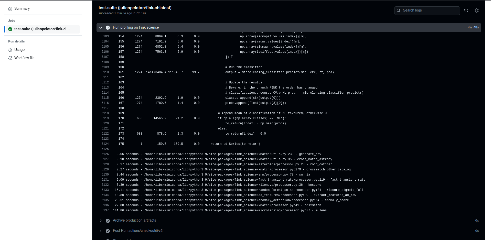
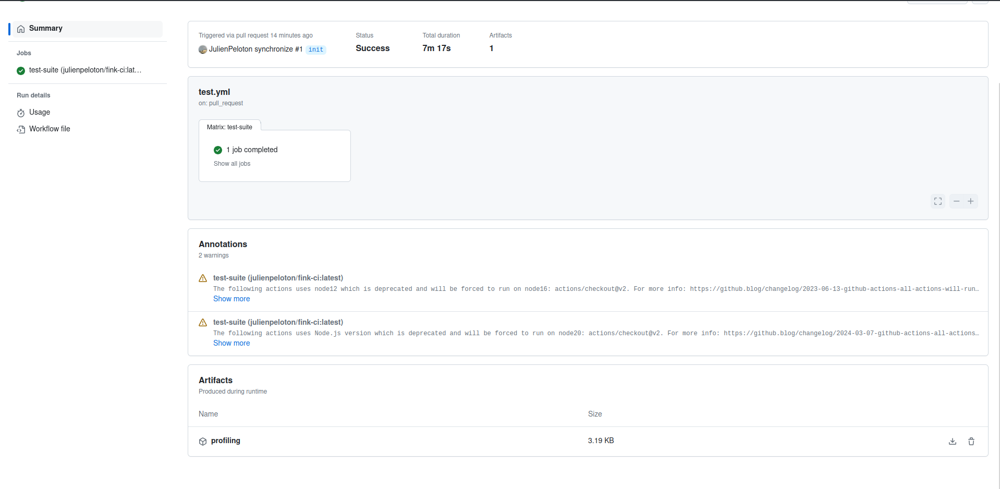
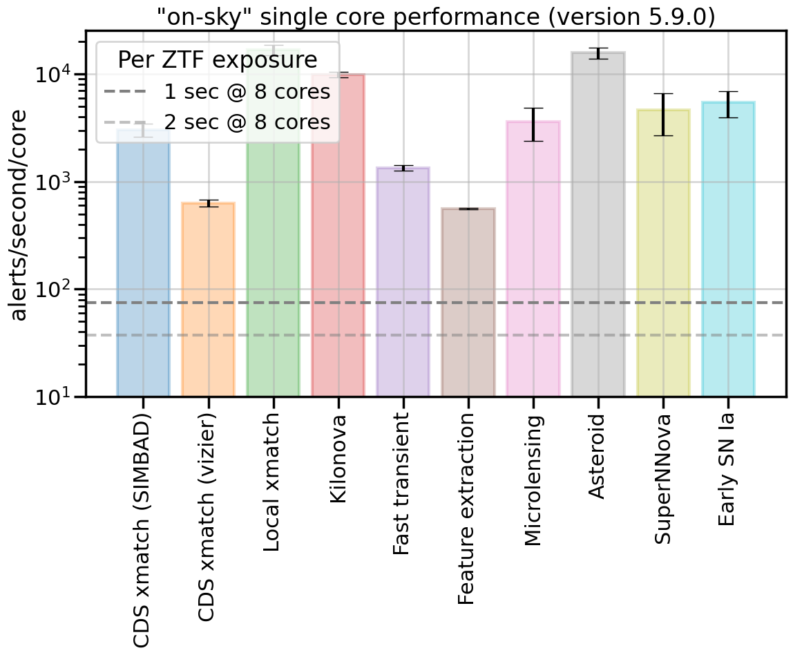

# Profiling & performance for fink-science

This repository contains scripts to perform the profiling and performance checks of [fink-science](https://github.com/astrolabsoftware/fink-science) modules.

## Online profiling

In order to profile user-defined functions in fink-science, you can use this repository:
1. clone (or fork) this repository
2. create a new branch
3. uncomment the section `Install custom fink-science version` in the [action](.github/workflows/test.yml) and install your branch with your new science module:

```yaml
- name: Install custom fink-science version
  run: |
   # remove fink-science
   pip uninstall -y fink-science
   # change to your branch
   pip install git+https://github.com/astrolabsoftware/fink-science.git@issue/397/profiling
```

4. in `/path/to/fink-science-perf`, update the list of science modules in [ztf/science_modules.py](ztf/science_modules.py) with your new science module:

```diff
@@ -98,13 +96,21 @@ def load_ztf_modules(module_name="") -> dict:
             'cols': ['cjd', 'cfid', 'cmagpsf', 'csigmapsf', 'cdsxmatch', F.col('candidate.ndethist')],
             'type': 'ml',
             'colname': 'rf_snia_vs_nonia'
+        },
+        {
+            'My New module': {
+                'processor': name_of_the_function_in_fink_science,
+                'cols': ['list', 'of', 'required', 'columns'],
+                'type': 'xmatch or ml or feature',
+                'colname': 'the name of the new column'
+            }
         }
     }
```


5. Push the code. You can inspect the results on the action log: 



or you can also download the artifact from the action page:
 
 

## Manual profiling

You can also do the profiling directly on your computer.

### Docker

Fire a docker container with all Fink dependencies installed:

```bash
# 2.3GB compressed
docker pull julienpeloton/fink-ci:latest

docker run -t -i --rm julienpeloton/fink-ci:latest bash
```

### Data

#### Direct download

You can simply download a sample of data (ZTF alerts, July 12 2024):

```bash
curl https://box.in2p3.fr/s/KFJ2pWDqNB85WNn/download --output ftransfer_ztf_2024-07-24_50931.tar.gz
tar -xvf ftransfer_ztf_2024-07-24_50931.tar.gz
```

#### Fink data transfer

But the best is to use the [Data Transfer](https://fink-portal.org/download) service to get tailored data for your test.
Make sure you have an account to use the [fink-client](https://github.com/astrolabsoftware/fink-client). Install it
and register your credentials on the container:

```bash
# Install the client
pip install fink-client

# register using your credentials
fink_client_register ... 
```

Trigger a job on the Data Transfer service and download data in your container (July 12 2024 is good to start, only 17k alerts):

```bash
# Change accordingly
TOPIC=ftransfer_ztf_2024-07-16_682277

mkdir -p /data/$TOPIC
fink_datatransfer \
            -topic $TOPIC \
            -outdir /data/$TOPIC \
            -partitionby finkclass \
            --verbose
```

### Profiling a new PR in fink-science

In case a user opens a new PR in fink-science and you want to profile the new code, you first need to
remove the fink-science dependency in the container:

```bash
pip uninstall fink-science
```

and clone the targeted version:

```bash
# e.g. modified version of fink-science
# corresponding to PR https://github.com/astrolabsoftware/fink-science/pull/396
git clone https://github.com/utthishtastro/fink-science.git
cd fink-science
git checkout hostless_detection
```

In case the code is not instrumented, add necessary decorators:

```python
from line_profiler import profile

@profile
def the_function_that_needs_to_be_profiled(...)
```

and install the code:

```bash
# in fink-science
pip install .
```

and finally clone this repository and update the list of science modules in [ztf/science_modules.py](ztf/science_modules.py):

```diff
@@ -98,13 +96,21 @@ def load_ztf_modules(module_name="") -> dict:
             'cols': ['cjd', 'cfid', 'cmagpsf', 'csigmapsf', 'cdsxmatch', F.col('candidate.ndethist')],
             'type': 'ml',
             'colname': 'rf_snia_vs_nonia'
+        },
+        {
+            'My New module': {
+                'processor': name_of_the_function_in_fink_science,
+                'cols': ['list', 'of', 'required', 'columns'],
+                'type': 'xmatch or ml or feature',
+                'colname': 'the name of the new column'
+            }
         }
     }
```

and profile your code with:

```bash
# Change arguments accordingly
./profile_module.sh -survey ztf -name 'My New module' -d /data/$TOPIC
```

Dependending on how many decorators you put in the code,
you will see a more or less details in the form. For example:

```python
File: /home/libs/fink-science/fink_science/hostless_detection/run_pipeline.py
Function: process_candidate_fink at line 31

Line #      Hits         Time  Per Hit   % Time  Line Contents
==============================================================
    31                                               @profile
    32                                               def process_candidate_fink(self, science_stamp: Dict,
    33                                                                          template_stamp: Dict, objectId: str):
    34                                                   """
    35                                                   Processes each candidate
    36                                           
    37                                                   Parameters
    38                                                   ----------
    39                                                   science_stamp
    40                                                      science stamp data
    41                                                   template_stamp
    42                                                      template stamp data
    43                                                   """
    44      1000    1217571.0   1217.6      1.8          science_stamp = read_bytes_image(science_stamp)
    45      1000    1026124.8   1026.1      1.5          template_stamp = read_bytes_image(template_stamp)
    46      1000       1110.8      1.1      0.0          if not ((science_stamp.shape == (63, 63)) and (template_stamp.shape == (63, 63))):
    47        15        288.4     19.2      0.0              print(objectId, science_stamp.shape, template_stamp.shape)
    48        15          5.1      0.3      0.0              return -99
    49       985        571.2      0.6      0.0          science_stamp_clipped, template_stamp_clipped = (
    50       985    4539642.4   4608.8      6.8              self._run_sigma_clipping(science_stamp, template_stamp))
    51      1970    2558995.9   1299.0      3.8          is_hostless_candidate = run_hostless_detection_with_clipped_data(
    52       985        208.7      0.2      0.0              science_stamp_clipped, template_stamp_clipped,
    53       985        541.1      0.5      0.0              self.configs, self._image_shape)
    54       985        418.2      0.4      0.0          if is_hostless_candidate:
    55        30   57607331.3    2e+06     86.0              power_spectrum_results = run_powerspectrum_analysis(
    56        15          3.8      0.3      0.0                  science_stamp, template_stamp,
    57        15         80.6      5.4      0.0                  science_stamp_clipped.mask.astype(int),
    58        15         55.5      3.7      0.0                  template_stamp_clipped.mask.astype(int), self._image_shape)
    59        15          8.4      0.6      0.0              return power_spectrum_results["kstest_SCIENCE_15_statistic"]
    60       970        449.2      0.5      0.0          return -99
```

What matters first is the column `% Time` which indicates the percentage of time
spent per call. In this example above, 86% is spent in calling `run_powerspectrum_analysis`
which would be the target to optimize if we want to improve the performances.

Another important column is `Hits`, that is the number of time an instruction has been done.
In this example, we started with 1,000 alerts, and the first lines were called 1,000 times.
But then we have a branch (`if is_hostless_candidate:`), and the costly function is 
actually only called 30 times.

## Performance checks

### Timing science modules

To launch the performance test, you can use the `ztf/perf_science_modules.py` script. It will launch a series of Spark jobs to time each science module.

```bash
python perf_science_modules.py -h
usage: perf_science_modules.py [-h] [-night NIGHT] [-total_memory TOTAL_MEMORY]
                               [-gb_per_executor GB_PER_EXECUTOR]
                               [-core_per_executor CORE_PER_EXECUTOR]
                               [-nloops NLOOPS]

Science modules performance using Apache Spark for ZTF

optional arguments:
  -h, --help            show this help message and exit
  -night NIGHT          Night in the form YYYYMMDD. Default is 20240716 (200k
                        alerts)
  -total_memory TOTAL_MEMORY
                        Total RAM for the job in GB. Default is 16GB.
  -gb_per_executor GB_PER_EXECUTOR
                        Total RAM per executor. Default is 2GB.
  -core_per_executor CORE_PER_EXECUTOR
                        Number of core per executor. Default is 1.
  -nloops NLOOPS        Number of times to run the performance test. Default is 2.
```

Note that it makes little sense to make performance tests from within a single container, and this script assumes you are on the Fink Apache Spark cluster at VirtualData. Edit `perf_science_modules.py` and `utils.load_spark_session` with your correct master URI, path to the data and mesos configuration. By default the script will run performance test using 8 cores with 2GB RAM each on the ZTF night 20240416 (212,039 alerts).

Here is the result for `fink-science==5.9.0` for ZTF alert data:




Note that if we profile directly the functions without Spark (see `ztf/co2_science_modules.py`), we obtain the same behaviour, but we about x10 speed-up. We need to investigate.

### Inferring CO2eq emissions

Based on [codecarbon](https://github.com/mlco2/codecarbon), we try to gain some insights regarding the CO2eq emissions linked to Fink operations. There are many caveats here, and one should be cautious with the results. In all results below, we use the codecarbon converter to transform energy measurement into kgCO2eq emissions, and corresponding rate. All operations are done on the spark-master @ VirtualData:

```
[codecarbon INFO @ 16:00:45]   Platform system: Linux-3.10.0-1160.36.2.el7.x86_64-x86_64-with-glibc2.17
[codecarbon INFO @ 16:00:45]   Python version: 3.9.13
[codecarbon INFO @ 16:00:45]   CodeCarbon version: 2.5.0
[codecarbon INFO @ 16:00:45]   Available RAM : 35.196 GB
[codecarbon INFO @ 16:00:45]   CPU count: 18
[codecarbon INFO @ 16:00:45]   CPU model: AMD EPYC 7702 64-Core Processor
[codecarbon INFO @ 16:00:45]   GPU count: None
[codecarbon INFO @ 16:00:45]   GPU model: None
```

and we execute the tests using:

```bash
taskset --cpu-list 0 python ztf/co2_science_modules.py
```

#### Default parameters

First we assume a PUE of the center of 1.25, and leave the rest of the parameters as default. The program recognises that we are in France, and it applies the energy mix accordingly. However, we could not access the CPU tracking mode, and a constant consumption mode was used instead (AMD EPYC 7702 64-Core Processor). 

We do two measurements: (A) the measure of the energy consumed during the execution of a science module (on 200k alerts), and (B) another measurement lasting the same amount of time with nothing particular running from our side. The two measurements are done one after each other, and we assume that the state of the server remains the same (no external jobs launched).

```bash
[profiling  INFO @ 03:59:56] Early SN Ia
# (A)
[codecarbon INFO @ 15:59:51] Energy consumed for RAM : 0.000001 kWh. RAM Power : 0.9447441101074219 W
[codecarbon INFO @ 15:59:51] Energy consumed for all CPUs : 0.000090 kWh. Total CPU Power : 100.0 W
[codecarbon INFO @ 15:59:51] 0.000091 kWh of electricity used since the beginning.
...
# (B)
[codecarbon INFO @ 15:59:54] Energy consumed for RAM : 0.000001 kWh. RAM Power : 0.9447441101074219 W
[codecarbon INFO @ 15:59:54] Energy consumed for all CPUs : 0.000091 kWh. Total CPU Power : 100.0 W
[codecarbon INFO @ 15:59:54] 0.000092 kWh of electricity used since the beginning.
...
[profiling  INFO @ 04:00:23] RAW: 31.27 # (A) in kgCO2eq/year
[profiling  INFO @ 04:00:23] BAS: 31.27 # (B) in kgCO2eq/year
[profiling  INFO @ 04:00:23] DIF: -0.00 # difference
```

On average, the emission rate (B) is around 30 kgCO2eq/year (again, one should not take this at face value, this depends on all the assumptions entered in the measurement), and for all science modules, the energy consumed in (A) is identical to the one in (B) (to the precision of the measurement). So either our science module is not consuming much compared to the electricty required to just keep the machine alive, or we do something wrong (e.g. the run is not long enough, some assumptions are wrong, etc.)

#### What is consuming the most: cpu, RAM, or just the machine itself?  

TODO: make measurements on cpu-bound and IO

